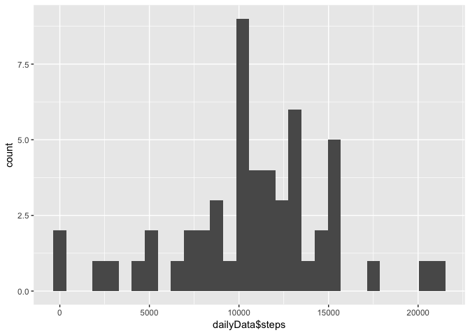
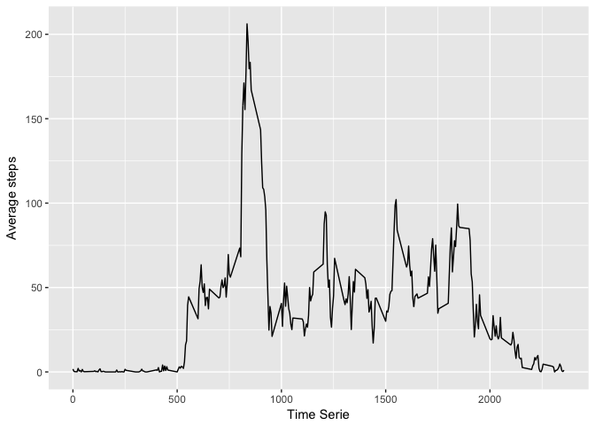
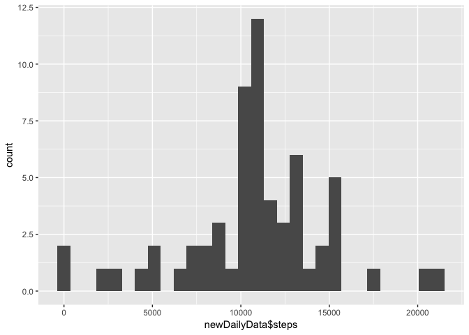
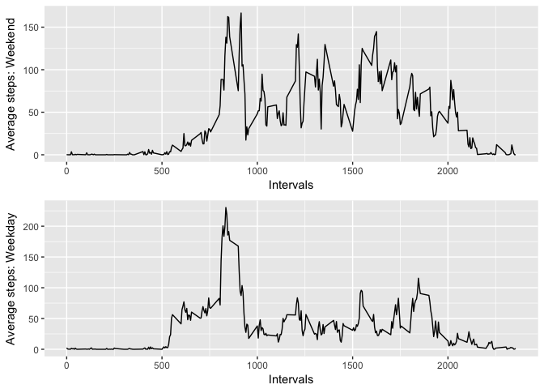

## Loading and preprocessing the data

#### Install packages, if needed
The first block of code just makes sure, you have the downloader package installed, and if not it proceeds to install it. Note that the reusults of this code chunk are deliberately hidden, as it is just so boring and takes half of the document. 

```r
list.of.packages <- c("downloader", "ggplot2", "timeDate", "gridExtra")
new.packages <- list.of.packages[!(list.of.packages %in% installed.packages()[,"Package"])]
if(length(new.packages)) install.packages(new.packages)
```

#### Download and unzip the data
In this section we will be reading downloading the data from the internet address (https://d396qusza40orc.cloudfront.net/repdata%2Fdata%2Factivity.zip). For dealing with the zip file, we use the CRAN package 'downloader'. This part was not particularly necessary, but I was interested to see how to deal with zip files and therefore ended up including it. 

```r
library(downloader)
tempdata<-download.file("https://d396qusza40orc.cloudfront.net/repdata%2Fdata%2Factivity.zip", destfile="./Factivity.zip", method="curl")
unzData<-unzip("Factivity.zip", exdir = "./")
```

### 1. Load the data

```r
data <- read.csv(unzData)
```

### 2. Process/transform the data (if necessary) into a format suitable for your analysis

```r
dataDf<-as.data.frame(data)
head(dataDf)
```

```
##   steps       date interval
## 1    NA 2012-10-01        0
## 2    NA 2012-10-01        5
## 3    NA 2012-10-01       10
## 4    NA 2012-10-01       15
## 5    NA 2012-10-01       20
## 6    NA 2012-10-01       25
```

```r
file.remove("Factivity.zip")
```

```
## [1] TRUE
```

## What is mean total number of steps taken per day?
First we calculate the number of steps per day, then draw the histogram and finally present the mean and median values while ignoring NA values.

###1. Calculate the total number of steps taken per day

```r
library(ggplot2)
dailyData<-aggregate(dataDf$steps, by=list(dataDf$date), FUN=sum)
colnames(dailyData)<-c("date", "steps")
head(dailyData)
```

```
##         date steps
## 1 2012-10-01    NA
## 2 2012-10-02   126
## 3 2012-10-03 11352
## 4 2012-10-04 12116
## 5 2012-10-05 13294
## 6 2012-10-06 15420
```

### 2. Make a histogram of the total number of steps taken each day
### 3. Calculate and report the mean and median of the total number of steps taken per day

```r
#And then we do the histogram
qplot(dailyData$steps, geom="histogram")
```

```
## `stat_bin()` using `bins = 30`. Pick better value with `binwidth`.
```

```
## Warning: Removed 8 rows containing non-finite values (stat_bin).
```

<!-- -->

```r
mean(dailyData$steps, na.rm=TRUE)
```

```
## [1] 10766.19
```

```r
median(dailyData$steps, na.rm=TRUE)
```

```
## [1] 10765
```

## What is the average daily activity pattern?
### 1. Make a time series plot of the 5-minute interval (x-axis) and the average number of steps taken, averaged across all days (y-axis)
Let's first calculate average steps in each time interval

```r
#Let's first calculate average steps in each time interval
timeSeriesData<-aggregate(dataDf$steps, by=list(dataDf$interval), FUN=mean, na.rm=TRUE)
colnames(timeSeriesData)<-c("interval", "av_steps")
head(timeSeriesData)
```

```
##   interval  av_steps
## 1        0 1.7169811
## 2        5 0.3396226
## 3       10 0.1320755
## 4       15 0.1509434
## 5       20 0.0754717
## 6       25 2.0943396
```

```r
#And then let's do the plot
ggplot(timeSeriesData, aes(interval, av_steps)) + geom_line() +
   xlab("Time Serie") + ylab("Average steps")
```

<!-- -->

### 2. Which 5-minute interval, on average across all the days in the dataset, contains the maximum number of steps?
Let's find the row index of the maximum value and print the corresponding time interval. 

```r
rowInd<-which.max(timeSeriesData[,2])
timeSeriesData[rowInd,1]
```

```
## [1] 835
```

## Imputing missing values
### 1. Calculate and report the total number of missing values in the dataset (i.e. the total number of rows with \color{red}{\verb|NA|}NAs)
This is pretty neat. We have already been using is.na() function when removing NAs in the R course. 

```r
sum(is.na(dataDf$steps))
```

```
## [1] 2304
```

### 2. Devise a strategy for filling in all of the missing values in the dataset. 
### 3. Create a new dataset that is equal to the original dataset but with the missing data filled in.
We have already calculated mean steps per each time interval in previous sections, so let's use this data to replace NA values in the original dataframe dataDf. 

The original dataset has 17568 rows. The same time intervals are repeated always after each day as one days contains 288time intervals, i.e. records. We use a mathematical concept of modululus (remainder) to replace the NA with a corresponding mean value. (OMG! how much I struggled with this small litle script)

```r
newDataDf<-dataDf   #new data frame
timeSeriesDataDf<-as.data.frame(timeSeriesData) #just to make sure

#there's probably more elegant solution available I guess, but this works
for (i in 1:nrow(newDataDf)){
        if (is.na(newDataDf[i,1])){
                #calculate modulus
                modulusInd<-i%%288
                if (modulusInd == 0) modulusInd<-288
                newDataDf[i,1]<-timeSeriesDataDf[modulusInd,2]
        }
        
}
#newDataDf is the new dataset
head(newDataDf)
```

```
##       steps       date interval
## 1 1.7169811 2012-10-01        0
## 2 0.3396226 2012-10-01        5
## 3 0.1320755 2012-10-01       10
## 4 0.1509434 2012-10-01       15
## 5 0.0754717 2012-10-01       20
## 6 2.0943396 2012-10-01       25
```

### 4. Make a histogram of the total number of steps taken each day and Calculate and report the mean and median total number of steps taken per day. Do these values differ from the estimates from the first part of the assignment? What is the impact of imputing missing data on the estimates of the total daily number of steps?

As in my strategy, the missing values were replaced by corresponding average values, the manoeuvre didn't have impact on the average, but naturally it had some impact on median, as expected: 

```r
newDailyData<-aggregate(newDataDf$steps, by=list(newDataDf$date), FUN=sum)
colnames(newDailyData)<-c("date", "steps")
head(newDailyData)
```

```
##         date    steps
## 1 2012-10-01 10766.19
## 2 2012-10-02   126.00
## 3 2012-10-03 11352.00
## 4 2012-10-04 12116.00
## 5 2012-10-05 13294.00
## 6 2012-10-06 15420.00
```

```r
#And then we do the histogram
qplot(newDailyData$steps, geom="histogram")
```

```
## `stat_bin()` using `bins = 30`. Pick better value with `binwidth`.
```

<!-- -->

```r
mean(newDailyData$steps, na.rm=TRUE)
```

```
## [1] 10766.19
```

```r
median(newDailyData$steps, na.rm=TRUE)
```

```
## [1] 10766.19
```


## Are there differences in activity patterns between weekdays and weekends?

### 1. Create a new factor variable in the dataset with two levels ??? weekday and weekend indicating whether a given date is a weekday or weekend day.


```r
library(timeDate)
#Let's first calculate the daily steps
newDailyData<-aggregate(newDataDf$steps, by=list(newDataDf$date), FUN=sum)
colnames(newDailyData)<-c("date", "steps")
head(newDailyData)
```

```
##         date    steps
## 1 2012-10-01 10766.19
## 2 2012-10-02   126.00
## 3 2012-10-03 11352.00
## 4 2012-10-04 12116.00
## 5 2012-10-05 13294.00
## 6 2012-10-06 15420.00
```

```r
#Let's then create a new column in our newDataDf with preset data
newDailyData$wDay<-c("weekday")
#I should probably use apply function here, but well.. this works
#So here we check whether the date is a weekend day, and assignt the corresponding slot with a propoer value. Here we use a package timeDate, which contains neat functions isWeekend and isWeekday. 

for (i in 1:nrow(newDailyData)){
        if (isWeekend(newDailyData[i,1])){
                newDailyData[i,3]<-"weekend"
        }
        
}
head(newDailyData)
```

```
##         date    steps    wDay
## 1 2012-10-01 10766.19 weekday
## 2 2012-10-02   126.00 weekday
## 3 2012-10-03 11352.00 weekday
## 4 2012-10-04 12116.00 weekday
## 5 2012-10-05 13294.00 weekday
## 6 2012-10-06 15420.00 weekend
```

### 2. Make a panel plot containing a time series plot (i.e. \color{red}{\verb|type = "l"|}type="l") of the 5-minute interval (x-axis) and the average number of steps taken, averaged across all weekday days or weekend days (y-axis). 


```r
#Let's first add the weekday data into the newDataDf dataset.
newDataDf<-as.data.frame(newDataDf)
newDataDf$wDay<-c("weekday")
for (i in 1:nrow(newDataDf)){
        if (isWeekend(newDataDf[[i,2]])){
                newDataDf[[i,4]]<-c("weekend")
        }
        
}

#Let's then create two separate filtered datasets for weekday data and one for weekends
splittedData<-split(newDataDf, newDataDf$wDay)
weekdayData<-splittedData$weekday
weekendData<-splittedData$weekend

weekDayPlotData<-aggregate(weekdayData$steps, by=list(weekdayData$interval), FUN=mean, na.rm=TRUE)
colnames(weekDayPlotData)<-c("interval", "av_steps")
head(weekDayPlotData)
```

```
##   interval   av_steps
## 1        0 2.25115304
## 2        5 0.44528302
## 3       10 0.17316562
## 4       15 0.19790356
## 5       20 0.09895178
## 6       25 1.59035639
```

```r
#and then same for the weekend

weekEndPlotData<-aggregate(weekendData$steps, by=list(weekendData$interval), FUN=mean, na.rm=TRUE)
colnames(weekEndPlotData)<-c("interval", "av_steps")
head(weekEndPlotData)
```

```
##   interval    av_steps
## 1        0 0.214622642
## 2        5 0.042452830
## 3       10 0.016509434
## 4       15 0.018867925
## 5       20 0.009433962
## 6       25 3.511792453
```

And finally, let's draw the panel plot:

```r
library(gridExtra)
weekdayGraph<-ggplot(weekDayPlotData, aes(interval, av_steps)) + geom_line() +
   xlab("Intervals") + ylab("Average steps: Weekday")
weekendGraph<-ggplot(weekEndPlotData, aes(interval, av_steps)) + geom_line() +
   xlab("Intervals") + ylab("Average steps: Weekend")
grid.arrange(weekendGraph, weekdayGraph, ncol=1, nrow=2)
```

<!-- -->

